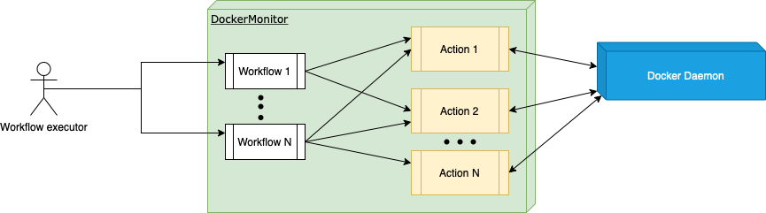

# Practical Guide to Command Pattern in Go (Golang)

After a few months of learning and working with Go, I've come to understand one pattern that is very useful in many cases when developing Golang applications - Command Pattern. 

This article will go over the command pattern, how it can be implemented, and when to use it in Go.

Consider a workflow with many actions. Each action in a workflow can be executed with its own set of contexts. However, the execution step should be identical across all workflow actions.

I will demonstrate this pattern with a simple use case that monitors Docker installed on a host. Below is what we will build. 

 

> :warning: **Make sure you know the commands you are running**: lease be careful of commands you run. Running arbitrary commands can cause an unexpected impact on your machine!


## Let's get coding. 

We can implement an action interface that will return any errors during the action execution.  
```go
type Action interface {
	execute(env string) error
}
```

Next, let's implement the Actions we will use for our docker monitoring. We first define structs that will hold required data for our monitoring application. Then we implement a constructor for our DockerMonitor instance.

```go
type DockerEnvironment struct {
	Environment            string
	StoppedContainers      int
	RunningContainers      int
	DockerVersion          string
	TotalLocalDockerImages int
	ContainersInfo         []ContainerInfo
	ImagesInfo             []ImageInfo
}

type DockerMonitor struct {
	DockerEnvironments []DockerEnvironment
}

type ContainerInfo struct {
	Command      string `json:"command"`
	CreatedAt    string `json:"createdAt"`
	ID           string `json:"id"`
	Image        string `json:"image"`
	Labels       string `json:"labels"`
	LocalVolumes string `json:"localVolumes"`
	Mounts       string `json:"mounts"`
	Names        string `json:"names"`
	Networks     string `json:"networks"`
	Ports        string `json:"ports"`
	RunningFor   string `json:"runningFor"`
	Size         string `json:"size"`
	State        string `json:"state"`
	Status       string `json:"status"`
}

type ImageInfo struct {
	Containers   string `json:"containers"`
	CreatedAt    string `json:"createdAt"`
	CreatedSince string `json:"createSince"`
	Digest       string `json:"digest"`
	ID           string `json:"id"`
	Repository   string `json:"repository"`
	SharedSize   string `json:"sharedSize"`
	Size         string `json:"size"`
	Tag          string `json:"tag"`
	UniqueSize   string `json:"uniqueSize"`
	VirtualSize  string `json:"virtualSize"`
}

func NewDockerMonitor(envs []string) *DockerMonitor {
	const InitialContainers = 0
	const InitialLocalImages = 0
	var dockerEnvironments []DockerEnvironment

	for _, env := range envs {
		dockerEnvironments = append(dockerEnvironments, DockerEnvironment{
			Environment:            env,
			StoppedContainers:      InitialContainers,
			RunningContainers:      InitialContainers,
			DockerVersion:          "",
			TotalLocalDockerImages: InitialLocalImages,
			ContainersInfo:         []ContainerInfo{},
			ImagesInfo:             []ImageInfo{},
		})
	}
	return &DockerMonitor{
		DockerEnvironments: dockerEnvironments,
	}
}

type CheckDockerVersion struct {
	dockerMonitor *DockerMonitor
}

func (c CheckDockerVersion) execute(env string) error {

	// We can used exec package to execute commands to a remote host as well
	// Here, the env parameter can be used to pass in hostname for the remote host.
	// cmd := exec.Command("ssh", "remote-machine", "bash-command")

	// WARNING:: Make sure you know the commands you are running.
	cmd := exec.Command("docker", "--version")
	out, err := cmd.Output()
	if err != nil {
		return err
	}

	version := string(out)

	for index, dockerEnv := range c.dockerMonitor.DockerEnvironments {
		if dockerEnv.Environment == env {
			c.dockerMonitor.DockerEnvironments[index].DockerVersion = version
		}
	}
	fmt.Println("Output:", version)
	return nil
}

type CheckContainersStatus struct {
	dockerMonitor *DockerMonitor
}

func TrimSuffix(s, suffix string) string {
	if strings.HasSuffix(s, suffix) {
		s = s[:len(s)-len(suffix)]
	}
	return s
}

func (c CheckContainersStatus) execute(env string) error {

	cmd := exec.Command("docker", "container", "ls", "-a", "--format", "\"{{json .}}\"")
	out, err := cmd.CombinedOutput() //Output()
	if err != nil {
		return err
	}
	var containerOutput []ContainerInfo
	adjustedString := strings.ReplaceAll(string(out), "\"{\"Command\":", "<===>\"{\"Command\":")
	containersArray := strings.Split(adjustedString, "<===>\"")

	stopped := 0
	running := 0

	for index, cont := range containersArray {
		if index != 0 {
			cont = strings.TrimSpace(cont)
			cont = TrimSuffix(cont, "\"")
			var jsonContainer ContainerInfo
			json.Unmarshal([]byte(cont), &jsonContainer)
			if jsonContainer.State == "exited" {
				stopped += 1
			} else {
				running += 1
			}
			containerOutput = append(containerOutput, jsonContainer)
		}
	}

	// containerOutput containes details of all container.
	// This can be used to parse other related information
	// fmt.Println(containerOutput)

	for index, dockerEnv := range c.dockerMonitor.DockerEnvironments {
		if dockerEnv.Environment == env {
			c.dockerMonitor.DockerEnvironments[index].StoppedContainers = stopped
			c.dockerMonitor.DockerEnvironments[index].RunningContainers = running
			c.dockerMonitor.DockerEnvironments[index].ContainersInfo = containerOutput
		}
	}
	fmt.Println("Stopped Containers:", stopped, "Running Containers:", running)

	return nil
}

type CheckLocalImages struct {
	dockerMonitor *DockerMonitor
}

func (c CheckLocalImages) execute(env string) error {

	cmd := exec.Command("docker", "images", "--format", "\"{{json .}}\"")
	out, err := cmd.CombinedOutput()
	if err != nil {
		return err
	}
	var imageOutput []ImageInfo
	adjustedString := strings.ReplaceAll(string(out), "\"{\"Containers\":", "<===>\"{\"Containers\":")
	imagesArray := strings.Split(adjustedString, "<===>\"")

	totalImages := 0

	for index, img := range imagesArray {
		if index != 0 {
			img = strings.TrimSpace(img)
			img = TrimSuffix(img, "\"")

			var jsonImage ImageInfo
			json.Unmarshal([]byte(img), &jsonImage)
			// Uncomment the lines below if you want to omit native kubernetes images
			// if strings.Contains(jsonImage.Repository, "k8s.gcr.io") || strings.Contains(jsonImage.Repository, "kubernetes") {
			// 	continue
			// }
			totalImages += 1
			imageOutput = append(imageOutput, jsonImage)
		}
	}

	for index, dockerEnv := range c.dockerMonitor.DockerEnvironments {
		if dockerEnv.Environment == env {
			c.dockerMonitor.DockerEnvironments[index].TotalLocalDockerImages = totalImages
			c.dockerMonitor.DockerEnvironments[index].ImagesInfo = imageOutput
		}
	}
	fmt.Println("Total local images:", totalImages)

	return nil
}

```

The following steps are to implement our docker monitoring workflow methods to call the above actions. 

```go
func (d *DockerMonitor ) CallDockerVersion() Action {
	return &CheckDockerVersion{
		dockerMonitor: d,
	}
}

func (d *DockerMonitor ) CallContainersStatus() Action {
	return &CheckContainersStatus{
		dockerMonitor: d,
	}
}

func (d *DockerMonitor ) CallLocalImages() Action {
	return &CheckLocalImages{
		dockerMonitor: d,
	}
}

```
As you can see, the DockerMonitor is only playing a role of a factory for the actions. Details of execution are left in the action implementation.

Finally, executing our workflow should be as easy as defining the actions we want to run. For instance, we can define a workflow for each environment and have a subset of actions per environment. 

```go
type Workflow struct {
	Name    string
	Actions []Action
}

func (w *Workflow) executeActions() error {
	fmt.Println("Executing workflow - ", w.Name)
	for _, a := range w.Actions {
		err := a.execute(w.Name)
		if err != nil {
			return err
		}
	}

	return nil
}
```

To run our application, we will need to tie everything together in the main function as follows: 

```go
func main() {
	envs := []string{"Dev Environment", "UAT Environment"}
	d := NewDockerMonitor(envs)

	// Here we assign actions we want to use for each environment.
	// If we chose, we can pass in args in this methods. For example: configs.
	devActions := []Action{
		d.CallDockerVersion(),
		d.CallContainersStatus(),
		d.CallLocalImages(),
	}
	uatActions := []Action{
		d.CallDockerVersion(),
		d.CallContainersStatus(),
		d.CallLocalImages(),
	}

	// We can have also multiple workflows and each take in an array of actions to execute.
	// other properties can also be used for scheduling or action sequencing as well.
	// Here, I am using Name to cleary identify which workflow is run.
	workflows := []*Workflow{
		{
			Name:    "Dev Environment",
			Actions: devActions,
		},
		{
			Name:    "UAT Environment",
			Actions: uatActions,
		},
	}

	// Here, we loop through the workflows to execute the actions
	// we return the error if we encounter one. We can also choose to break the loop if the
	// workflow are dependent of each other.
	for index, w := range workflows {
		fmt.Println("#", index, " Worklow - ", w.Name, ":")
		err := w.executeActions()
		if err != nil {
			fmt.Println("Error occurred:", err)
		}
	}

	// Since we create the instance of DockerMoinitor using NewDockerMonitor()
	// We can access it's properties at anytime like below.
	// The actions will update these properties, hence abstructing any execution details.
	fmt.Println(d.DockerEnvironments[0].ContainersInfo[0].Image)

}
```
Running our application will display the following output:

```bash
❯ go run main.go
# 0  Worklow -  Dev Environment :
Executing workflow -  Dev Environment
Output: Docker version 20.10.8, build 3967b7d

Stopped Containers: 1 Running Containers: 2
Total local images: 17
# 1  Worklow -  UAT Environment :
Executing workflow -  UAT Environment
Output: Docker version 20.10.8, build 3967b7d

Stopped Containers: 1 Running Containers: 2
Total local images: 17
postgres
```

Feel free to check out the complete code on GitHub.